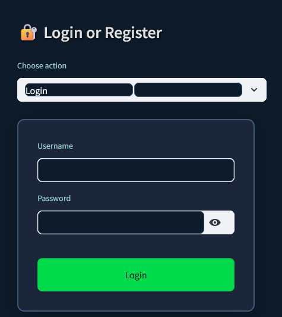
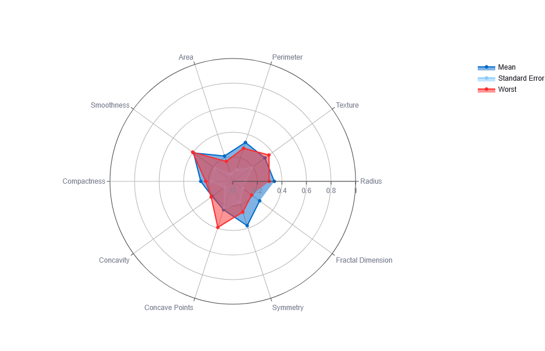
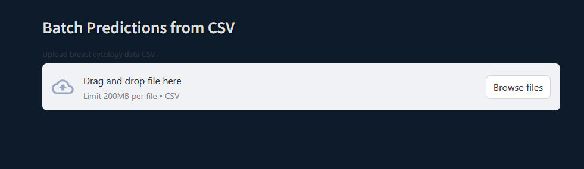

# 🧠 Breast Cancer Predictor App (Streamlit + ML + DICOM)

An end-to-end web application for predicting breast cancer using machine learning and DICOM image analysis. Built with **Streamlit**, it supports:

- **Manual Input** (cytology features via sliders)
- **Batch Prediction** (upload CSV)
- **DICOM Image Segmentation & Quantitative Features**
- **Dual-Model Architecture** (cytology-only & combined cytology+DICOM)
- **User Authentication** (Login / Register / Forgot Password)
- **Calibrated Probabilities** to avoid over-confidence
- **Dark-themed UI** with custom CSS

---

## 📌 Project Overview

**Title:** Breast Cancer Predictor  
**Problem Statement:** Early and accurate diagnosis of breast cancer is critical. This app combines classic cytology features with DICOM-based imaging biomarkers to improve predictive power.  
**Goals:**
- Provide a simple UI for clinical decision support
- Offer both cytology-only predictions (v1) and cytology+DICOM predictions (v2)
- Calibrate probability outputs to reduce over-confidence (v3)
- Secure access via user accounts

---

## 📈 Key Features

1. **Interactive Frontend**  
   - Streamlit sliders for 30 cytology features  
   - CSV uploader for batch runs  
   - Real-time radar chart of input features  
2. **Dual Models**  
   - **v1**: Logistic Regression on cytology only (`model_v1.pkl`)  
   - **v2**: Cytology + imaging features from segmented DICOM (`model_v2.pkl`)  
   - **v3**: Calibrated cytology-only model with `CalibratedClassifierCV` (`model_v3.pkl`)  
3. **DICOM Integration**  
   - Load & decompress series  
   - Otsu segmentation (`segment_volume`)  
   - Extract volume, surface area, mean slice area  
   - Visualization of slice+mask  
4. **Authentication & Authorization**  
   - Register / Login / Forgot Password flow  
   - Session-based access  
5. **Probability Calibration**  
   - Sigmoid calibration applied to v3  
   - Improves trustworthiness of predicted probabilities  
6. **Modular Code Structure**  
   - `model/` for training scripts & pickles  
   - `app/` for Streamlit UI  
   - `utils.py` for auth logic  
   - `dicom.py` for image processing  
7. **Custom Styling**  
   - Dark theme via `assets/style.css`  
8. **Documentation & Report**  
   - Full project report in Word format  
   - UML, architecture & data-flow diagrams included  

---

## ⚙️ Installation & Setup

1. **Clone & enter repo**  
   ```bash
   git clone https://github.com/juliuslaggah/breast-cancer-predictor.git
   cd breast-cancer-predictor


2. **Create and Activate a Virtual Environment**

```bash
python -m venv venv
# Windows
venv\Scripts\activate
# macOS/Linux
source venv/bin/activate
```

3. **Install Dependencies**

```bash
pip install -r requirements.txt
```

---

## 📦 Dependencies

Here are the main packages used:

```
streamlit
scikit-learn
pandas
matplotlib
shap             # Optional for XAI
joblib
plotly           # For radar chart visualization
```

Install them manually (if needed):

```bash
pip install streamlit scikit-learn pandas matplotlib shap joblib plotly
```

---

## Prepare data & DICOM folders
Place data/data.csv in root

Ensure dicom/train/… and dicom/test/… subfolders as per mapping

dicom_mapping.json maps patient IDs to folder paths

## 🚀 How to Run the App

From the project root directory, run:

```bash
streamlit run app/main.py
```

Then open the URL provided by Streamlit in your browser.

---

## 🖼️ Sample Screenshots

<details>
<summary>🔐 Login Page</summary>



</details>

<details>
<summary>📊 Single Prediction</summary>



</details>

<details>
<summary>📁 Batch Prediction with CSV</summary>



</details>

---

## 📄 Report

The full project report is available [here](report/Breast_Cancer_Predictor_Report.pdf)  
> _(Ensure you upload the Word file inside a `report/` folder in the repository)_

---

## 👥 Authors

- Julius Laggah – Data Science, Model Calibration
- Sandar Win – Frontend & DICOM Visualization
- Adamsay Turay – UI/UX & Streamlit Integration
- Jusu Abdul Karim – Backend, Authentication & CI/CD


---

## ✅ License

This project is open-source and available under the GPL v.3 License.

[](https://www.python.org/)
[](https://streamlit.io/)
[](LICENSE)

